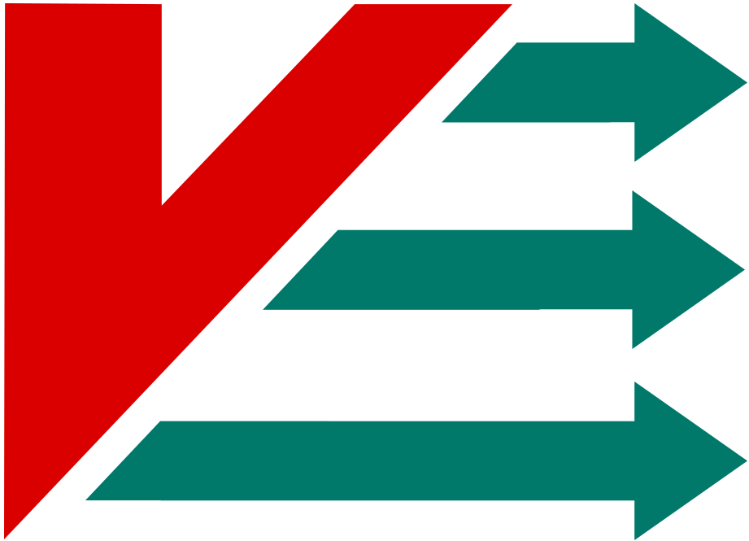
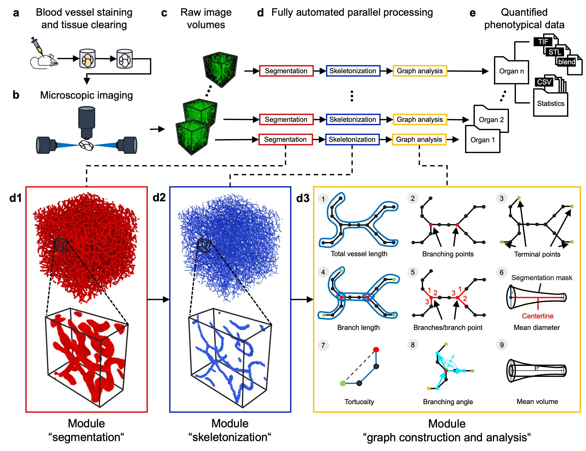

 
&nbsp;
 

***

&nbsp;

&nbsp;

&nbsp;

***

&nbsp;

&nbsp;

&nbsp;

***

&nbsp;&nbsp;

# VesselExpress
### Rapid and fully automated bloodvasculature analysis in 3D light sheet image volumes of different organs.</h3>

&nbsp;

VesselExpress is an open-source software designed for rapid, fully automated and scalable analysis of vascular datasets 
in high-throughput sequences.
It processes raw microscopic images (2D or 3D) of blood vessels in  parallel  and outputs quantified  phenotypical  data  along with image and object files of the rendered vasculature.
The processing steps include segmentation, skeletonization, graph construction and analysis and optional rendering.
These steps are automated in a pipeline with the workflow management system [Snakemake](https://github.com/snakemake/snakemake) 
(see workflow [DAG](imgs/dag.pdf)).
The whole pipeline can be run via Docker or locally. 

**Notes:** It is also possible to execute each step individually with the
corresponding Python script. Existing modules can be exchanged in the [Snakefile](Snakefile) with custom scripts.
For processing larger images it is recommended to use the ClearMap skeletonization by Kirst et al. Therefore please clone their
[repository](https://github.com/MartinFinkenflugel/ClearMap2/tree/3617414d6d56709b452b2c5253631eecbede1b85)
and copy the ClearMap folder into the projects root folder. 
For the graph construction the Python script
[networkx_graph_from_array](https://github.com/3Scan/3scan-skeleton/blob/master/skeleton/networkx_graph_from_array.py)
from the
[3scan-skeleton repository](https://github.com/3Scan/3scan-skeleton#3d-image-skeletonization-tools) is used.
This is downloaded from GitHub and copied into the Graph folder. Many thanks to GitHub and the contributors!

***

## Docker Version

&nbsp;

&nbsp;

&nbsp;

&nbsp;

1. Install Docker for your operating system from [here](https://docs.docker.com/get-docker/).
2. Start Docker.
3. Pull the Docker image from DockerHub via `docker pull vesselexpress:latest` or navigate into the VesselExpress directory and call `docker build -t vesselexpress .`.
4. Run the docker container with `docker run -v path-to-data-and-config:/vesselexpress/data`

## Local Version (without Docker)
1. Install Anaconda following the [installation instructions](https://docs.anaconda.com/anaconda/install/index.html).
2. Install Snakemake following the [installation instructions](https://snakemake.readthedocs.io/en/stable/getting_started/installation.html)
3. In a terminal navigate to the project's root folder and type
`snakemake --use-conda --cores all --conda-frontend conda`

Different parameters can be set by using the command line option '--config' or by changing the parameters in the
config.json file. A full description of command line arguments for Snakemake can be found
[here](https://snakemake.readthedocs.io/en/v4.5.1/executable.html).

## Correspondence

[**Prof. Dr. Axel Mosig**](mailto:axel.mosig@rub.de): Bioinformatics, Center for Protein Diagnostics (ProDi), Ruhr-University Bochum, Bochum, Germany

http://www.bioinf.rub.de/

[**Prof. Dr. Matthias Gunzer**](mailto:matthias.gunzer@uni-due.de): Institute for Experimental Immunology and Imaging, University Hospital Essen, University of Duisburg-Essen, Essen, Germany

https://www.uni-due.de/experimental-immunology

# Tutorial Video
You can use this YouTube Video for vizualized instructions on how to download, setup and run VesselExpress on example data:

&nbsp;

# Download and Install

See the [Releases](https://github.com/RUB-Bioinf/LightSheetBrainVesselSkeletonization/releases) page on how to download the latest version of the pipeline.
Then refer to [this guide in the wiki](https://github.com/RUB-Bioinf/LightSheetBrainVesselSkeletonization/wiki/Running-the-Pipeline) on how to set up and run the pipeline.

## Example Data

Please follow [this guide](https://github.com/RUB-Bioinf/https://github.com/RUB-Bioinf/VesselExpress/wiki/Example-Data) on how to download example data.

# Feedback & Bug Reports

We strive to always improve and make this pipeline accessible to the public.
We hope to make it as easy to use as possible.

Should you encounter an error, bug or need help, please feel free to reach out to us via the [Issues](https://github.com/RUB-Bioinf/VesselExpress/issues) page.
Thank you for your help. Your feedback is much appreciated.

# Misc

Visit the [wiki](https://github.com/RUB-Bioinf/LightSheetBrainVesselSkeletonization/wiki) for additional information.

# FrangiExpress

[FrangiExpress](https://github.com/RUB-Bioinf/LightSheetBrainVesselSegmentation) is an additional segmentation module 
based on a neural network approach.

Reference: Weilin Fu (2019) Frangi-Net on High-Resolution Fundus (HRF) image database [Source Code]. https://doi.org/10.24433/CO.5016803.v2

****

**Keywords**: stroke; Neuronal Vessel Morphology; High Throughput Light Sheet Microscopy; 3D Skeletonization

****

**Funding**: This research received no external funding.

**Conflicts of Interest**: The authors declare no conflict of interest
