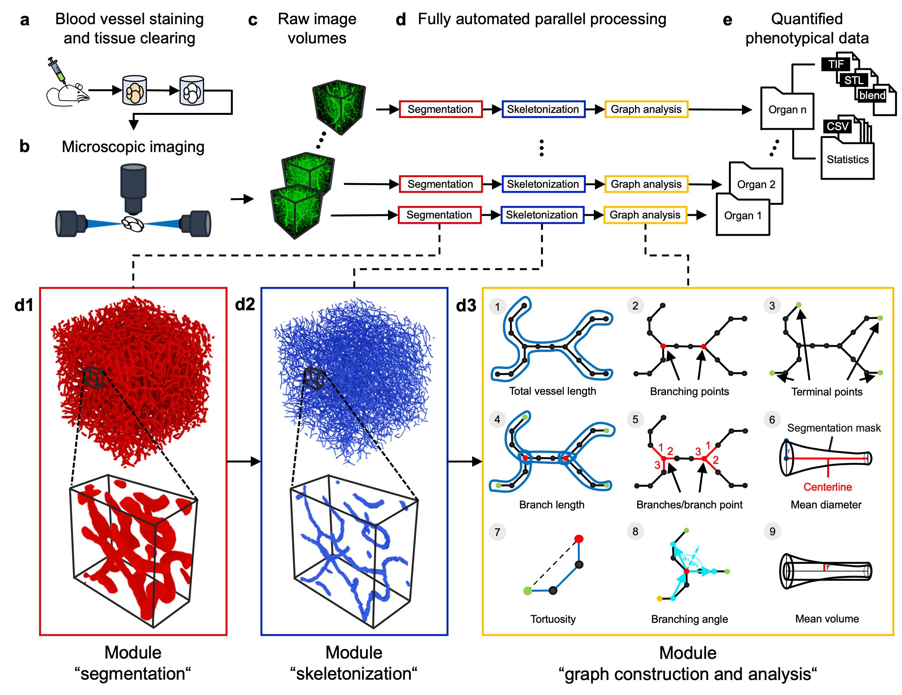

<p style="text-align:center; margin-bottom: 0px"></p>
<h1 style="margin:0px; padding-top: 0px">VesselExpress</h1>
<h3 style="margin-top: 0px">Rapid and fully automated bloodvasculature analysis in 3D light sheet image volumes of different organs.</h3>

[](https://github.com/RUB-Bioinf/VesselExpress) 
&nbsp;
[](https://github.com/RUB-Bioinf/VesselExpress/releases) 
&nbsp;
[](https://twitter.com/intent/follow?screen_name=NilsFoer)
&nbsp;
[](https://twitter.com/intent/follow?screen_name=saskra1)
&nbsp;

[](https://github.com/RUB-Bioinf/VesselExpress/graphs/contributors)
&nbsp;
[](https://github.com/RUB-Bioinf/VesselExpress/LICENSE)
&nbsp;
[](https://github.com/RUB-Bioinf/VesselExpress)
&nbsp;
[](https://lgtm.com/projects/g/RUB-Bioinf/VesselExpress/context:python)
&nbsp;

&nbsp;
[](https://github.com/RUB-Bioinf/VesselExpress/issues)
&nbsp;
[](https://github.com/RUB-Bioinf/VesselExpress/pulls)
&nbsp;
[](https://github.com/RUB-Bioinf/VesselExpress/)
&nbsp;
[](https://github.com/RUB-Bioinf/VesselExpress/)
&nbsp;
[](https://github.com/RUB-Bioinf/VesselExpress/releases)


*VesselExpress* is an open-source software designed for rapid, fully automated and scalable analysis of vascular datasets 
in high-throughput sequences. It processes raw microscopic images (2D or 3D) of blood vessels in  parallel  and outputs 
quantified  phenotypical  data  along with image and object files of the rendered vasculature. The processing steps include segmentation, skeletonization, graph construction with analysis and 
optional rendering. These steps are automated in a pipeline with the workflow management system [Snakemake](https://github.com/snakemake/snakemake) 
(see workflow [DAG](VesselExpress/imgs/dag.pdf)). The whole pipeline can be run via Docker or locally from the command line or 
web browser using the web interface. 



**Notes:** It is also possible to execute each step individually with the
corresponding Python script. Existing modules can be exchanged with custom scripts in the [Snakefile](VesselExpress/workflow/Snakefile).

***

## Docker Version
[](https://hub.docker.com/r/philippasp/vesselexpress)
&nbsp;
[](https://hub.docker.com/r/philippasp/vesselexpress)
&nbsp;
[](https://hub.docker.com/r/philippasp/vesselexpress)
&nbsp;
[](https://hub.docker.com/r/philippasp/vesselexpress)
&nbsp;
[](https://hub.docker.com/r/philippasp/vesselexpress)

1. Install Docker for your operating system from [here](https://docs.docker.com/get-docker/).
2. Start Docker.
3. Get the Docker image
   1. from DockerHub \
      via ```docker pull philippasp/vesselexpress_cli```
      for the command-line version \
      or via `docker pull philippasp/vesselexpress` for the web version.
   2. or build the Docker image \
      by calling `docker build -t vesselexpress_cli .` from the VesselExpress directory for the command-line version\
      or by calling `docker build -f ./Webinterface/Dockerfile -t vesselexpress .` for the web version.
4. Run the command-line version via `docker run -v path-to-data-and-config:/home/user/VesselExpress/data philippasp/vesselexpress_cli`
   if you've pulled the image from DockerHub or via `docker run -v path-to-data-and-config:/home/user/VesselExpress/data vesselexpress_cli`
   if you've manually built the image as described above. 
   The first part of the command specifies the absolute path on your host 
   containing image files to process and the configuration file. An example configuration file and 3D image can be found in
   the [data](VesselExpress/data) folder.
5. Run the web version via `docker run -p 5000:5000 philippasp/vesselexpress` if you've pulled the image from DockerHub or 
   via `docker run -p 5000:5000 vesselexpress` if you've manually built the image as described above. Naviagte to 
   `localhost:5000` in your browser to open the web interface. 
   On macOS Monterey you need to uncheck "AirPlay Receiver" in the "Sharing" system preference to use the web
   interface on port 5000.

## Local Version (without Docker)
We recommend using the Docker version. The local version is intended for development.
So far we have tested this on Ubuntu and macOS. If you're using Windows, please use the Docker version.

For the command-line version follow these instructions:
1. Install Blender from [here](https://www.blender.org/download/) (optional for rendering). \
   We used Blender 2.83.4 on Linux and Blender 2.83.5 on macOS.
   You might need to adjust the path to Blender on your system in the [Snakefile](VesselExpress/workflow/Snakefile).
2. Install Anaconda following the [installation instructions](https://docs.anaconda.com/anaconda/install/index.html).
3. Install Snakemake following the [installation instructions](https://snakemake.readthedocs.io/en/stable/getting_started/installation.html).
4. In a terminal navigate to the project's root folder and type
`snakemake --use-conda --cores all --conda-frontend conda`.

Different parameters can be set by using the command line option '--config' or by changing the parameters in the
[config.json](VesselExpress/data/config.json) file. A full description of command line arguments for Snakemake can be found
[here](https://snakemake.readthedocs.io/en/v4.5.1/executable.html).

For the web version follow these instructions:
1. Install [Blender](https://www.blender.org/download/) (see description above).
2. Type `pip install -r /Webinterface/requirements.txt`.
3. Type `python /Webinterface/server/app.py` to run the web application.
4. In your browser navigate to `localhost:5000` to open the webpage.

## Correspondence

[**Prof. Dr. Axel Mosig**](mailto:axel.mosig@rub.de): Bioinformatics, Center for Protein Diagnostics (ProDi), Ruhr-University Bochum, Bochum, Germany

http://www.bioinf.rub.de/

[**Prof. Dr. Matthias Gunzer**](mailto:matthias.gunzer@uni-due.de): Institute for Experimental Immunology and Imaging, University Hospital Essen, University of Duisburg-Essen, Essen, Germany

https://www.uni-due.de/experimental-immunology

## Tutorial Video (coming soon)
You can use this YouTube Video for visualized instructions on how to download, setup and run VesselExpress on example data:

[](https://www.youtube.com/watch?v=ScMzIvxBSi4)

[](https://www.youtube.com/watch?v=ScMzIvxBSi4)
&nbsp;
[](https://www.youtube.com/watch?v=ScMzIvxBSi4)


## Example Data (coming soon)

Download our example data from [here]().


## Feedback & Bug Reports

We strive to always improve and make this pipeline accessible to the public.
We hope to make it as easy to use as possible.

Should you encounter an error, bug or need help, please feel free to reach out to us via the [Issues](https://github.com/RUB-Bioinf/VesselExpress/issues) page.
Thank you for your help. Your feedback is much appreciated.

## References
1. The Vascular Modeling Toolkit. http://www.vmtk.org
2. Fu, W. Frangi-Net on High-Resolution Fundus (HRF) image database. (2019). https://doi.org/10.24433/CO.5016803.v2 
3. Pesavento, M & Vemuri, P. 3D Image Skeletonization Tools.  (2019). https://github.com/pranathivemuri/skeletonization/commit/b7bd1ce06e557905a32307677c77c1b94305ba5c
****

**Keywords**: stroke; Neuronal Vessel Morphology; High Throughput Light Sheet Microscopy; 3D Skeletonization

****

**Funding**: This research received no external funding.

**Conflicts of Interest**: The authors declare no conflict of interest
