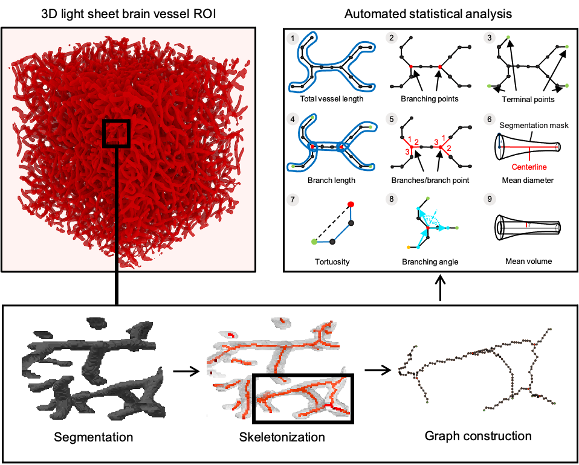

# **Automated Analysis of 3D Light Sheet Brain Vessel Images**

This repository contains Python scripts for extracting features of 3D light sheet brain vessel images which have been
automated with the workflow management system [Snakemake](https://github.com/snakemake/snakemake).

The automated analysis pipeline contains the following steps:

1. Segmentation
2. Skeleton extraction
3. Graph construction
4. Statistical analysis



For processing larger images it is recommended to use the ClearMap skeletonization. To use that please clone their
[repository](https://github.com/MartinFinkenflugel/ClearMap2/tree/3617414d6d56709b452b2c5253631eecbede1b85)
and copy the ClearMap folder into the projects root folder. For further information please read their 
[paper](https://www.sciencedirect.com/science/article/abs/pii/S0092867420301094).
For the graph construction the Python script
[networkx_graph_from_array](https://github.com/3Scan/3scan-skeleton/blob/master/skeleton/networkx_graph_from_array.py)
from the
[3scan-skeleton repository](https://github.com/3Scan/3scan-skeleton#3d-image-skeletonization-tools) is used. This is
downloaded from GitHub and copied into the Graph folder. Many thanks to GitHub and the contributors!

## Tutorial
To run the pipeline please follow the instructions below:
* install Miniconda following the [installation instructions](https://conda.io/projects/conda/en/latest/user-guide/install/index.html)
* install Snakemake following the [installation instructions](https://snakemake.readthedocs.io/en/stable/getting_started/installation.html)
or use the runtime environment from the Envs folder which has Snakemake installed.
* in a terminal navigate to the project's root folder and type
```
snakemake --use-conda --cores all
```

Different parameters can be set by using the command line option '--config' or by changing the parameters in the
config.json file. A full description of command line arguments for Snakemake can be found
[here](https://snakemake.readthedocs.io/en/v4.5.1/executable.html).
```
snakemake --config imgFolder='/path/to/images' --use-conda --cores all
```


 


