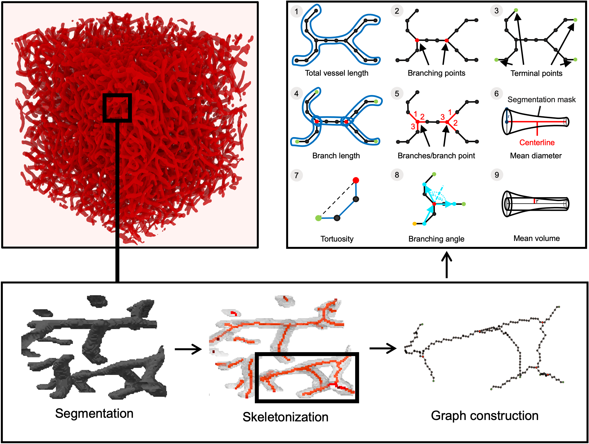

<p align="center">  </p>
<h2 align="center"> VesselExpress: Rapid and fully automated blood vasculature analysis in 3D light-sheet image volumes of different organs </h2>

[](https://github.com/RUB-Bioinf/VesselExpress) 
&nbsp;
[](https://github.com/RUB-Bioinf/VesselExpress/releases) 
&nbsp;
[](https://twitter.com/intent/follow?screen_name=NilsFoer)
&nbsp;
[](https://twitter.com/intent/follow?screen_name=saskra1)

[](https://github.com/RUB-Bioinf/VesselExpress/graphs/contributors)
&nbsp;
[](https://github.com/RUB-Bioinf/VesselExpress/LICENSE)
&nbsp;

&nbsp;
[](https://github.com/RUB-Bioinf/VesselExpress/issues)
&nbsp;
[](https://github.com/RUB-Bioinf/VesselExpress/pulls)
&nbsp;
[](https://github.com/RUB-Bioinf/VesselExpress/)
&nbsp;
[](https://github.com/RUB-Bioinf/VesselExpress/)
&nbsp;
[](https://github.com/RUB-Bioinf/VesselExpress/releases)

***

*VesselExpress* is an open-source software designed for rapid, fully automated and scalable analysis of vascular datasets 
in high-throughput sequences. It processes raw microscopic images (2D or 3D) of blood vessels in  parallel  and outputs 
quantified  phenotypical  data  along with image and object files of the rendered vasculature. The processing steps include segmentation, skeletonization, graph construction with analysis and 
optional rendering. These steps are automated in a pipeline with the workflow management system [Snakemake](https://github.com/snakemake/snakemake) 
(see workflow [DAG](VesselExpress/imgs/dag.pdf)). The whole pipeline can be run via Docker or locally from the command line or 
web browser using the web interface. 

[](https://github.com/RUB-Bioinf/VesselExpress)
&nbsp;
[](https://lgtm.com/projects/g/RUB-Bioinf/VesselExpress/context:python)



**Notes:** It is also possible to execute each step individually with the
corresponding Python script. Existing modules can be exchanged with custom scripts in the [Snakefile](VesselExpress/workflow/Snakefile).

## Tutorial Video
You can use this YouTube Video for visualized instructions on how to download, setup and run VesselExpress on example data.
By clicking on the image, you will be redirected to an external webseite to view the video.
Learn more about the video [here](https://github.com/RUB-Bioinf/VesselExpress/wiki/YouTube-Tutorial-Video).

[](https://www.youtube.com/watch?v=a8GWVKJNh68)

[](https://www.youtube.com/watch?v=a8GWVKJNh68)
&nbsp;
[](https://www.youtube.com/watch?v=a8GWVKJNh68)

## Docker Version

| Browser-Based User Interface | Command-Line only |
| --- | --- |
| [](https://hub.docker.com/r/phispa1812/vesselexpress)       | [](https://hub.docker.com/r/phispa1812/vesselexpress_cli)       |
| [](https://hub.docker.com/r/phispa1812/vesselexpress) | [](https://hub.docker.com/r/phispa1812/vesselexpress_cli) |
| [](https://hub.docker.com/r/phispa1812/vesselexpress)       | [](https://hub.docker.com/r/phispa1812/vesselexpress_cli)       |
| [](https://hub.docker.com/r/phispa1812/vesselexpress)           | [](https://hub.docker.com/r/phispa1812/vesselexpress_cli)           |
| [](https://hub.docker.com/r/phispa1812/vesselexpress)             | [](https://hub.docker.com/r/phispa1812/vesselexpress_cli)             |

If you want to use the **browser version**, follow these instructions:
1. Install Docker for your operating system from [here](https://docs.docker.com/get-docker/).
2. Start Docker.
3. Get the Docker image
   1. from DockerHub via `docker pull phispa1812/vesselexpress`
   2. or build the Docker image by calling `docker build -f ./Webinterface/Dockerfile -t vesselexpress .`
4. Run VesselExpress via 
   1. `docker run -p 5000:5000 phispa1812/vesselexpress` if you've pulled the image from DockerHub 
   2. or via `docker run -p 5000:5000 vesselexpress` if you've manually built the image as described above.
5. Navigate to `localhost:5000` in your browser (e.g. Firefox or Google Chrome) to open the web interface. On macOS Monterey you need to uncheck "AirPlay Receiver" in the "Sharing" system preference to use the web interface on port 5000.

If you want to use the **command-line interface**, follow these instructions:

1. Install Docker for your operating system from [here](https://docs.docker.com/get-docker/).
2. Start Docker.
3. Get the Docker image
   1. from DockerHub via ```docker pull phispa1812/vesselexpress_cli```
   2. by calling ```docker build -t vesselexpress_cli .``` from the [VesselExpress](VesselExpress) directory.
4. Run VesselExpress
   1. via `docker run -v path-to-data-and-config:/home/user/VesselExpress/data phispa1812/vesselexpress_cli`
      if you've pulled the image from DockerHub 
   2. or via `docker run -v path-to-data-and-config:/home/user/VesselExpress/data vesselexpress_cli`
      if you've manually built the image as described above. \
      The first part of the command specifies the absolute path on your host 
      containing image files to process and the configuration file. An example configuration file and 3D image can be found in
      the [data](VesselExpress/data) folder. By default VesselExpress uses all cores for computation. We recommend 
      decreasing the number of cores when working on an office PC to avoid out of memory errors. You can specify the 
      number of cores via the flag -e. To run VesselExpress with 4 cores use ```docker run -v path-to-data-and-config:/home/user/VesselExpress/data -e 'CORES=4' vesselexpress_cli```

## Local Version (without Docker)
We recommend using the Docker version. The local version is intended for development.
So far we have tested this on Ubuntu and macOS (excluding Frangi-Net). If you're using Windows, please use the Docker version.

For the **browser version** follow these instructions:
1. Install [Blender](https://www.blender.org/download/) (optional for rendering). \
 We used Blender 2.83.4 on Linux and Blender 2.83.5 on macOS.
   You might need to adjust the path to Blender on your system in the [Snakefile](VesselExpress/workflow/Snakefile).
2. Download all packages via `pip install -r Webinterface/requirements.txt`.
3. Type `python Webinterface/server/app.py` to run the web application.
4. In your browser navigate to `localhost:5000` to open the webpage.

For the **command-line version** follow these instructions:
1. Install Blender from [here](https://www.blender.org/download/) (see descriptions above). 
2. Install Anaconda following the [installation instructions](https://docs.anaconda.com/anaconda/install/index.html).
3. Install Snakemake following the [installation instructions](https://snakemake.readthedocs.io/en/stable/getting_started/installation.html).
4. In a terminal navigate to the [VesselExpress](VesselExpress) folder and type
`snakemake --use-conda --cores all --conda-frontend conda --snakefile "./workflow/Snakefile"`.

Different parameters can be set by using the command line option '--config' or by changing the parameters in the
[config.json](VesselExpress/data/config.json) file. A full description of command line arguments for Snakemake can be found
[here](https://snakemake.readthedocs.io/en/v4.5.1/executable.html).

You can learn more about how to set up and run VesselExpress [here](https://github.com/RUB-Bioinf/VesselExpress/wiki/Running-the-Pipeline).
## Wiki

There is a lot of useful information in our [wiki](https://github.com/RUB-Bioinf/VesselExpress/wiki).

Two important pages are:
 - Our [FAQ](https://github.com/RUB-Bioinf/VesselExpress/wiki/FAQ)
 - Our detailed overview over VesselExpress' [parameters](https://github.com/RUB-Bioinf/VesselExpress/wiki/Parameters-for-VesselExpress) for a customized execution. 

## Correspondence

[**Prof. Dr. Axel Mosig**](mailto:axel.mosig@rub.de): Bioinformatics, Center for Protein Diagnostics (ProDi), Ruhr-University Bochum, Bochum, Germany

http://www.bioinf.rub.de/

[**Prof. Dr. Matthias Gunzer**](mailto:matthias.gunzer@uni-due.de): Institute for Experimental Immunology and Imaging, University Hospital Essen, University of Duisburg-Essen, Essen, Germany

https://www.uni-due.de/experimental-immunology

## Example Data

[](https://doi.org/10.5281/zenodo.5733150)

Download our example data from [Zenodo](https://zenodo.org/record/5733150#.YajQ1S9Xb5k) containing 3D light-sheet microscopic images of different organs with corresponding preset parameters for each organ. For segmentation parameter tuning you can use our [Napari plugin](https://www.napari-hub.org/plugins/vessel-express-napari).

## Feedback & Bug Reports

We strive to always improve and make this pipeline accessible to the public.
We hope to make it as easy to use as possible.
For your convinience we have set up a [FAQ here](https://github.com/RUB-Bioinf/VesselExpress/wiki/FAQ).

Should you encounter an error, bug or need help, please feel free to reach out to us via the [Issues](https://github.com/RUB-Bioinf/VesselExpress/issues) page.
Thank you for your help. Your feedback is much appreciated. 👍

## References
1. Chen, J., et al. The Allen Cell Structure Segmenter: a new open source toolkit for segmenting 3D intracellular structures in fluorescence microscopy images. bioRxiv, 491035 (2018)
2. Fu, W. Frangi-Net on High-Resolution Fundus (HRF) image database. (2019). https://doi.org/10.24433/CO.5016803.v2 
3. Pesavento, M & Vemuri, P. 3D Image Skeletonization Tools.  (2019). https://github.com/pranathivemuri/skeletonization/commit/b7bd1ce06e557905a32307677c77c1b94305ba5c
4. Bumgarner, J., Nelson, R. Open-source analysis and visualization of segmented vasculature datasets with VesselVio. Cell Reports Methods (2022),
https://doi.org/10.1016/j.crmeth.2022.100189.
****

**Funding**: This research received no external funding.

**Conflicts of Interest**: The authors declare no conflict of interest.

**Corresponding publication**: https://doi.org/10.1016/j.crmeth.2023.100436
